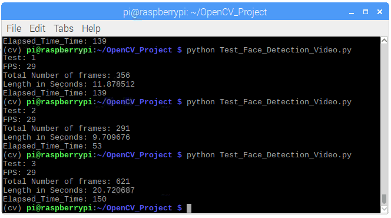

## Face Detection and Blurring

Face detection refers to a subset of computer technology that is able to identify people’s faces within digital images. Face detection applications employ algorithms focused on detecting human faces within larger images that might contain landscapes, objects and other parts of humans. Face detection technology might begin by searching for human eyes. It might do this by testing valley regions in the gray-level image. It might then use a genetic algorithm to detect facial regions including eyebrows, the mouth, nose, nostrils and the iris.

The implemented algorithm starts by importing a video file. Then, the algorithm processes each frame in the video in order to detect any face. Since not all faces appear as frontal faces, two different classifiers were used to obtain faces from each frame. After detecting the faces, the algorithm applies Gaussian filter on the detected faces to make them look blurred, and hence, hide the person’s face. The algorithm ran on Raspberry Pi 3.

| Video | Duration | Processing Time |
| --- | --- | --- |
| [Test_1](https://youtu.be/zPJyEtc9QXQ) | 11.88 Sec | 139 Sec |
| [Test_2](https://youtu.be/991RZZTRZ2Q) | 9.71 Sec | 53 Sec |
| [Test_3](https://youtu.be/hf6mCup4lmM) | 20.72 Sec | 150 Sec |

Samples of the results:

